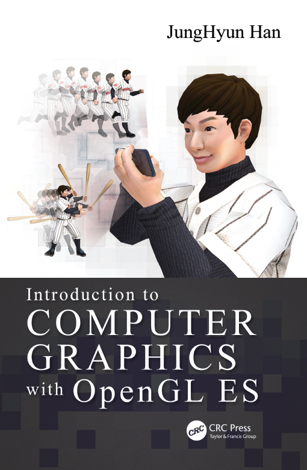
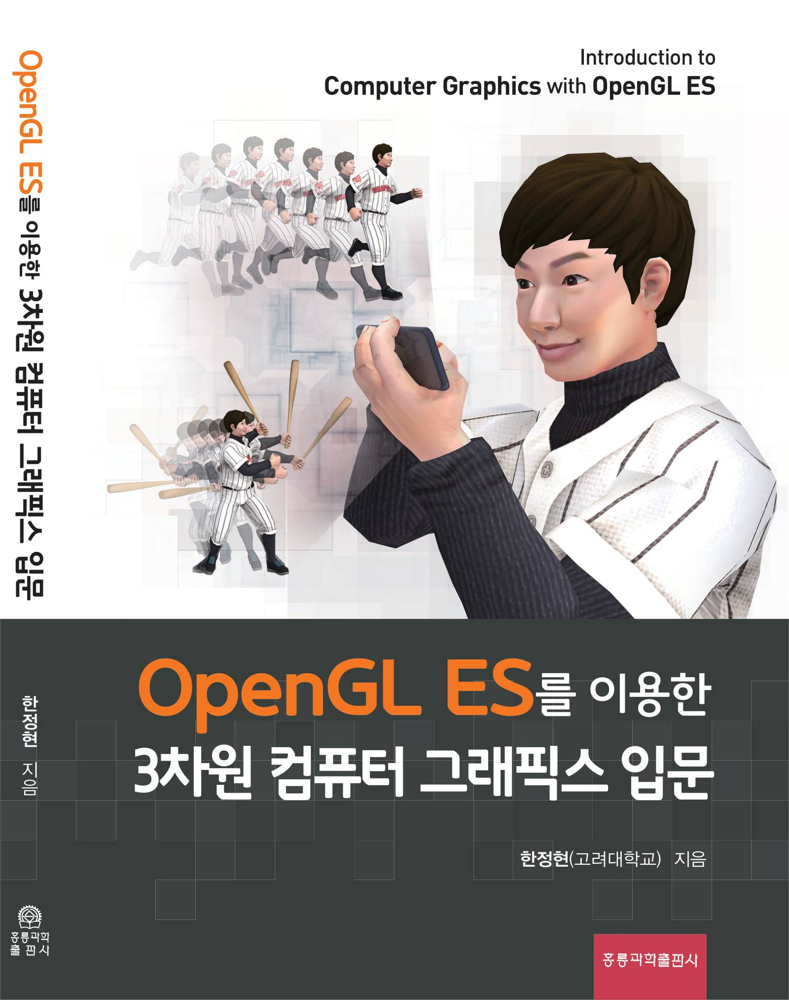
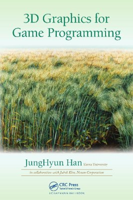
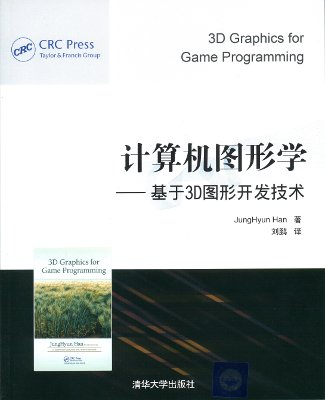

			<h2>Introduction to Computer Graphics with OpenGL ES</h2>
             
			<table width="300" cellspacing="0" cellpadding="10" border="0">
				<tbody><tr>
					<td>English Edition (CRC Press, 2018.06)</td>
					<td>Korean Edition (홍릉과학출판사, 2019.05) * 2019 세종도서 선정</td>
				</tr>
				<tr>
					<td></td>
					<td></td>
				</tr>
			</tbody></table>
             
			<h3>Review and Recommendations</h3>
             
			

				이 책의 영문 제목 “Introduction to Computer Graphics”를 “A Painless Introduction to Computer
				Graphics”라는 닉네임으로 바꿔서 부르고 싶다. 수학을 두려워하는 독자의 고통을 최소화하기 위하여
				아주 세세한 부분까지 신경을 쓴 저자의 친절함이 돋보인다. 직관적으로 이해되는 기발한 발상의 그림과
				설명으로 가득 찬 보물상자를 열어보는 느낌을 갖게 되는 그래픽스 입문서이다.
				 
				<b>-- 서울대학교 컴퓨터공학부 교수 김명수</b>
			

			

				저자가 지난 여름 영문 원서를 출간했을 때, 우리나라 그래픽스 분야 발전을 위해 이를 빨리 번역해야
				한다고 재촉했었다. 10개월 후 완성된 이 번역본은 영문판보다 더욱 가다듬어진 내용을 담고 있다.
				3차원 그래픽스에 입문하고자 하는 사람들은 물론, 실무에서 습득한 그래픽스 기술을 체계적으로
				정리하고자 하는 사람들에게 이보다 더 적합한 교재는 없을 것이라 확신한다.
				 
				<b>-- POSTECH 컴퓨터공학과 교수 이승용</b>
			

			

				“검은사막 모바일” 개발을 시작할 무렵 OpenGL ES를 처음 접했는데, 그 때 이러한 입문서가
				없었던 것이 큰 아쉬움으로 남는다. 이 책은 OpenGL ES 뿐 아니라 컴퓨터 그래픽스를 배우고자
				하는 분들에게 꼭 필요한 내용을 쉽고 알차게 설명하고 있다. 학생과 개발자에게 길잡이가 될 수 있는
				실용적인 책이 출간된 것을 기쁘게 생각한다.
				 
				<b>-- 펄어비스 이사회 의장 김대일</b>
			

             
			<h3>Key Features</h3>
             
			<ul>
				<li>
					Presents key graphics algorithms that are commonly employed by state-of-the-art
					game engines and 3D user interfaces
				</li>
				<li>
					Provides a hands-on look at real-time graphics by illustrating OpenGL ES and
					shader code on various topics
				</li>
				<li>
					Depicts troublesome concepts using elaborate 3D illustrations so that they can
					be easily absorbed
				</li>
				<li>
					Includes problem sets, solutions manual, and lecture notes for those wishing to
					use this book as a course text
				</li>
			</ul>
             
			<h3>Lecture Notes</h3>
             
			<ul>
				<li><a href="./notes/2/TOC and preface.pdf">TOC and Preface</a></li>
				<li><a href="./notes/2/chapter 1 (introduction).ppt">Chapter 1 (introduction)</a></li>
				<li><a href="./notes/2/chapter 2 (math basics).ppt">Chapter 2 (math basics)</a></li>
				<li><a href="./notes/2/chapter 3 (modeling).ppt">Chapter 3 (modeling)</a></li>
				<li><a href="./notes/2/chapter 4 (spaces and transforms).ppt">Chapter 4 (spaces and transforms)</a></li>
				<li><a href="./notes/2/chapter 5 (vertex processing).ppt">Chapter 5 (vertex processing)</a></li>
				<li><a href="./notes/2/chapter 6 (OpenGL ES and shader).ppt">Chapter 6 (OpenGL ES and shader)</a></li>
				<li><a href="./notes/2/chapter 7 (rasterizer).ppt">Chapter 7 (rasterizer)</a></li>
				<li><a href="./notes/2/chapter 8 (image texturing).ppt">Chapter 8 (image texturing)</a></li>
				<li><a href="./notes/2/chapter 9 (lighting).ppt">Chapter 9 (lighting)</a></li>
				<li><a href="./notes/2/chapter 10 (output merger).ppt">Chapter 10 (output merger)</a></li>
				<li><a href="./notes/2/chapter 11 (Euler transforms and quaternions).ppt">Chapter 11 (Euler transforms and quaternions)</a></li>
				<li><a href="./notes/2/chapter 12 (screen-space object manipulation).ppt">Chapter 12 (screen-space object manipulation)</a></li>
				<li><a href="./notes/2/chapter 13 (character animation).ppt">Chapter 13 (character animation)</a></li>
				<li><a href="./notes/2/chapter 14 (normal mapping).ppt">Chapter 14 (normal mapping)</a></li>
				<li><a href="./notes/2/chapter 15 (shadow mapping).ppt">Chapter 15 (shadow mapping)</a></li>
				<li><a href="./notes/2/chapter 16 (texturing toward GI).ppt">Chapter 16 (texturing toward GI)</a></li>
				<li><a href="./notes/2/chapter 17 (curves and surfaces).ppt">Chapter 17 (curves and surfaces)</a></li>
				<li><a href="./notes/2/chapter 18 (surface tessellation).ppt">Chapter 18 (surface tessellation)</a></li>
			</ul>
             
			

			<h2>3D Graphics for Game Programming</h2>
             
			<table width="900" cellspacing="0" cellpadding="10" border="0">
				<tbody><tr>
					<td>English Edition (CRC Press, 2011.02)</td>
					<td>Korean Edition (홍릉과학출판사, 2011.07) * 대한민국학술원 우수학술도서 선정</td>
					<td>Chinese Edition (清华大学出版社, 2013.01)</td>
				</tr>
				<tr>
					<td></td>
					<td></td>
					<td></td>
				</tr>
			</tbody></table>
			 
			<h3>Review and Recommendations</h3>
             
			

				This book provides an overview of the skills needed to create 3D
				graphics for game programming (although many of the skills would
				translate to a broader 3D graphics context). ... The book covers
				pretty much every important facet of the topic ... This could
				certainly be used as a text for advanced undergraduates interested in
				game programming. ...	Professionals interested in learning game
				programming might also find the text helpful ...
				 
				<b>-- Jeffrey Putnam, <i>Computing Reviews</i>, March 2012</b>
			

			

				JungHyun Han is a masterful teacher, and nowhere do his teachings
				come through more clearly than in <b>3D Graphics for Game
				Programming</b>. Han presents the essential foundations of graphics
				programming that every serious game programmer needs in a
				straightforward no-nonsense style that gets right to the point. I
				highly recommend this book for anyone who wants to program 3D
				games. 
				 
				<b>-- Jesse Schell, CEO of Schell Games and professor of entertainment technology at Carnegie Mellon University</b>
			

			

				The author has sought to satisfy a need experienced by the growing
				pool of game development students: a textbook that balances theory and
				practicality. The resulting compilation provides a broad coverage of
				the most important topics to graphics programmers. I would expect that
				anyone who has digested this material would be immediately effective
				as a member of a game development team. 
				 
				<b>-- Michael Guerrero, Delta3D game engine senior programmer and research associate of the Naval Postgraduate School</b>
			

             
			<h3>Lecture Notes</h3>
             
			<ul>
				<li><a href="./notes/1/toc_and_preface.pdf">TOC and Preface</a></li>
				<li><a href="./notes/1/chapter1.ppt">Lecture Note 01 (2012-04-28)</a></li>
				<li><a href="./notes/1/chapter2.ppt">Lecture Note 02 (2012-04-28)</a></li>
				<li><a href="./notes/1/chapter3.ppt">Lecture Note 03 (2012-04-28)</a></li>
				<li><a href="./notes/1/chapter4.ppt">Lecture Note 04 (2012-04-28)</a></li>
				<li><a href="./notes/1/chapter5.ppt">Lecture Note 05 (2012-04-28)</a></li>
				<li><a href="./notes/1/chapter6.ppt">Lecture Note 06 (2012-05-10)</a></li>
				<li><a href="./notes/1/chapter7.zip">Lecture Note 07 (2012-05-30)</a></li>
				<li><a href="./notes/1/chapter8.ppt">Lecture Note 08 (2013-04-22)</a></li>
				<li><a href="./notes/1/chapter9.ppt">Lecture Note 09 (2012-06-14)</a></li>
				<li><a href="./notes/1/chapter10.ppt">Lecture Note 10 (2012-06-14)</a></li>
				<li><a href="./notes/1/chapter11.ppt">Lecture Note 11 (2013-04-22)</a></li>
				<li><a href="./notes/1/chapter12.ppt">Lecture Note 12 (2011-02-28)</a></li>
				<li><a href="./notes/1/errata.pdf">Errata (2011-06-23)</a></li>
			</ul>
		
